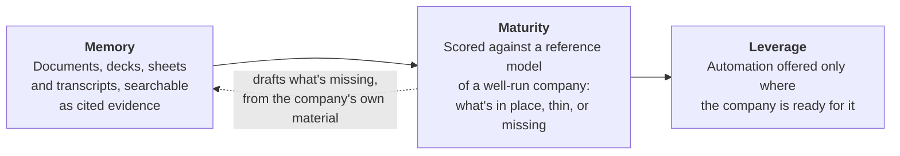
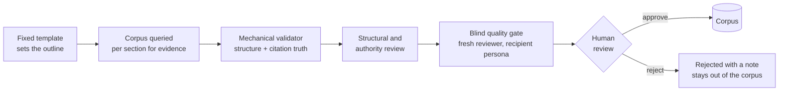

# Ladder

**A company knowledge system that reads a company's documents, shows it what a well-run company
at its stage maintains, and helps close the difference with real work.**

Many companies build up knowledge without compounding it. Documents sit across a dozen
tools, nobody can say what is missing, and the leverage that a company's own knowledge could
provide goes unused. Ladder treats this as a path a company climbs, one rung at a time:



Each layer depends on the one below it. You can't automate a sales loop without a CRM, you
can't build the CRM well without the pipeline data, and you won't know either is missing until
something reads the corpus and says so.

---

## What a company gets

### 1. Memory: the company's own record, searchable and cited
Ladder ingests a company's mixed documents (spreadsheets, decks, PDFs, governance files, policies,
transcripts) into a single queryable knowledge base. Any AI client that speaks the
[Model Context Protocol](https://modelcontextprotocol.io) can query it, including Claude and
ChatGPT. Search results point back to the source documents. Ingested material is treated as
evidence: Ladder doesn't rewrite it on its own.

### 2. Maturity: a board that shows the whole company at a glance
The corpus is judged against a **reference model** of what an operationally mature early-stage
company maintains: **11 categories and 83 operating areas**.

| Category | Areas | | Category | Areas |
|---|---|---|---|---|
| Go-to-market | 16 | | Finance | 8 |
| Legal | 10 | | People | 8 |
| Operations | 9 | | Capital | 7 |
| Engineering | 8 | | Product | 6 |
| AI operations | 5 | | Compliance | 3 |
| Vision | 3 | | | |

Each area becomes a tile on the board, with a verdict, the reasoning behind it, the source
documents it relied on, and the specific elements expected but not found:

| Tile | Meaning |
|---|---|
| 🟩 **In place** | Evidence found, with citations |
| 🟨 **Needs work** | It exists but falls short of the reference |
| 🟥 **Missing** | Not there, and the ingest log confirms it wasn't simply missed |
| ⬜ **We couldn't see it** | The material may exist but wasn't ingested, so it isn't scored as a gap |
| ▫️ **Doesn't apply** | The area is conditional and the condition isn't met (e.g. physical operations for a remote software company) |

The distinction between **Missing** and **We couldn't see it** is deliberate. A board that flags
"you don't have X" when X was never uploaded loses trust fast, so every board carries a
**coverage disclosure** stating what was and wasn't ingested.

### 3. Closing gaps honestly
Different gaps close in different ways, so each gap is classified first (see [`GAP-CLASS-DOCTRINE.md`](reference-model/GAP-CLASS-DOCTRINE.md)):

| Gap class | Example | What Ladder does | When the tile turns green |
|---|---|---|---|
| **Artifact** | No ICP definition, no metrics definitions | Drafts the document from the company's own material | A human approves it and it enters the corpus |
| **System** | The pipeline lives in a spreadsheet and there is no CRM | Recommends the class of system and seeds its structure from existing data | The system exists and the records migrate |
| **Practice** | A review cadence that's written down but never runs | Provides the scaffold (template, checklist, cadence) | Evidence that the practice actually runs shows up in later material |

A generated policy that nobody follows is exactly what the board exists to catch. That's why a
generated document can turn a tile green only where the document itself is the requirement.

### 4. Leverage: automation the company is actually ready for
A curated menu of ten automation opportunities, each qualified against the company's own board:

- Meeting and call capture into the knowledge base
- Records freshness and enrichment
- Drafting from the company's own material
- Bill payment and ledger sync
- Continuous compliance monitoring
- Failed-payment recovery
- Employee onboarding and offboarding cascade
- Inbound lead handling
- Customer-health scoring with triggered playbooks
- Whole-corpus intelligence

A deterministic resolver marks each item **available**, **not yet** (naming the exact
prerequisite tiles to climb first), **not offered**, or **pilot**. The menu links back to the
board, and a "not yet" lists every unmet prerequisite. Knowing which processes to keep with people
is part of maturity too.

---

## How a draft gets made

When a gap is artifact-sufficient, Ladder drafts the missing document through a staged pipeline
designed to produce a document fit for its intended reader:



- **Citation truth.** Any quoted attribution must appear word for word in the cited source, or
  the draft fails.
- **Blind gate.** A fresh-context reviewer sees only the finished document and the person who
  would receive it, with no hint that it was machine-produced, and blocks anything that isn't
  ready for that reader.
- **One at a time, explicitly.** Drafts are approved individually. There's no batch approval and
  no auto-adoption into the corpus.
- **Professional review where it matters.** Documents in areas that need attorney or HR review
  can't be finalized until that review is recorded.
- **Hard exclusions.** Ladder generates nothing in litigation or dispute areas; those requests are
  refused before any model is called.
- **Decisions stay with the company.** Where a document needs a decision only the company can make
  (who owns the capital plan, what milestone the next raise must prove), the draft states the
  question, lists any candidate answers from the company's documents, and marks it
  **Decision required**.

---

## Built for trust

- **Single-tenant by design.** Each company gets its own isolated instance: its own repository,
  database and services. Isolation is physical, with separate databases and services, and no shared system
  holds several companies' data.
- **Your evidence stays distinguishable.** The board and retrieval can be limited to
  company-native evidence, excluding anything Ladder generated, so an untouched baseline view is
  always available.
- **Disclosed on the board.** Coverage gaps, generated content and conditional areas are labeled
  on the board.
- **Spend is capped.** Batch runs carry explicit dollar caps and stop at the cap. The
  expensive model is used only where judgment needs it.
- **Proven engines for the commodity layers.** Ingestion, embedding and retrieval use proven
  engines behind a swappable interface, with license and portability recorded in
  [`PORTABILITY-LEDGER.md`](PORTABILITY-LEDGER.md). Ladder's own engineering goes into the parts
  that differentiate it: the reference model, gap detection, the board and generation.

---

## The reference model

The reference model is the core of Ladder. Each category is built from a research brief under a
written [research protocol](reference-model/RESEARCH-PROTOCOL.md), which requires that:

- criteria trace to **citable, genre-diverse authorities**: statute and regulation where they
  apply, then established practitioner and investor sources (for example NVCA model documents,
  SEC and IRS rules, Delaware code, SOC 2 trust services criteria);
- every area defines **what complete means at the company's stage** ("Band 1": seed-funded B2B
  software, pre-Series A, US scope), so an early company is graded against its own
  stage;
- conditional areas activate only when their trigger is present, and areas that don't apply are
  never scored as absent.

Three of its seams are stated openly:
- **Most of the model is observed.** It was calibrated against the documents of a real, mature
  seed-stage company (anonymized here) that had completed SOC 2.
- **The AI-operations category is authored.** It comes from expertise, because the reference company predates the requirement.
- **The calibration company is a test case, never an oracle.** A genuine absence there is a finding
  about that company.

Start with [`reference-model/TAXONOMY.md`](reference-model/TAXONOMY.md) and
[`reference-model/CRITERIA-SCHEMA.yaml`](reference-model/CRITERIA-SCHEMA.yaml).

---

## What's proven and what isn't

| Layer | Status |
|---|---|
| **Memory** | Built and running in production on live company instances. |
| **Maturity** | Built. The full 83-area board has been run end to end against a real company corpus, with human adjudication of the results. The draft pipeline, review lifecycle and blind gate are in place. |
| **Leverage** | The menu and its board-qualified resolver are built. Live automation loops in a company's own tools are the next rung: a hard systems-integration problem, and the least-tested part of the design. They are the next stage of work. |

Precision is the hard part of the maturity layer: telling a real absence apart from a document
that simply wasn't ingested. Coverage disclosure, the ingest-log check and the separate
"we couldn't see it" state all exist to keep false alarms off the board.

---

## What's in this repository

This repository holds the method: specs, the reference model, the generation templates, the
board, and the classifier and generation code. **No customer documents, corpora, board runs or
generated drafts are included.** They stay private to each instance. The calibration company is
anonymized throughout; some reference-model working notes record per-area calibration verdicts
without identifying it. Docs
that mention those files (`runs-of-record/`, `generated-drafts/`, `CREDENTIALS.md`) describe the
private working setup.

| Path | What it is |
|---|---|
| [`STATE-OF-LADDER.md`](STATE-OF-LADDER.md) | What is built today, the rules Ladder operates under, architecture, and what is open |
| [`Ladder-Product-Concept.md`](Ladder-Product-Concept.md) | The thesis, the three layers, and a worked go-to-market example |
| [`Ladder-Roadmap.md`](Ladder-Roadmap.md) | Build sequence, governing principles, decision gates, risks |
| [`Sprint-M-Memory.md`](Sprint-M-Memory.md) · [`Sprint-Ma-Maturity.md`](Sprint-Ma-Maturity.md) · [`Sprint-L-Leverage.md`](Sprint-L-Leverage.md) | Per-layer build specs |
| [`PORTABILITY-LEDGER.md`](PORTABILITY-LEDGER.md) | Adopted dependencies, licenses and swap boundaries |
| [`reference-model/`](reference-model/README.md) | Taxonomy, criteria schema, research protocol, per-category briefs, gap doctrine, generation standard |
| [`generation-templates/`](generation-templates/README.md) | The templates that drive document generation |
| [`leverage/`](leverage/README.md) | The automation menu catalog and resolver mapping |
| [`board/`](board/) | The maturity board (React + Vite) |
| [`scripts/classifier/`](scripts/classifier/) | Board runs, the judge, retrieval, the generation pipeline and validators |
| [`scripts/leverage/`](scripts/leverage/) | The menu resolver |
| [`docs/working-notes/`](docs/working-notes/README.md) | The working record: build lessons, method logs, template proposals, and the rules the build ran under with AI coding agents |

## Running the board locally

The board renders a board run of record and serves the remediation flow (generate a draft on a
gap, review it, approve it) over localhost. Runs of record aren't shipped here, so you supply
one from your own instance.

```
cd board && npm install && npm run build && node ../scripts/board-server.ts
```

Then open **http://localhost:4200/**. Generation and re-judging need a `.env` with
`ANTHROPIC_API_KEY`, `CLASSIFIER_QUERY_URL` and `CLASSIFIER_QUERY_TOKEN` (see `.env.example`).
Nothing is written to a corpus without an explicit approve, followed by a separate adopt step
(`scripts/adopt-draft.ts`). Port override: `BOARD_PORT=<n> node scripts/board-server.ts`.

---

## Working with Ladder

Ladder is deployed as a dedicated instance per company. If you're a company that wants to see its
own board, or a partner interested in the reference model or deployment, reach out through the
maintainer's GitHub profile ([@agshipley](https://github.com/agshipley)).
