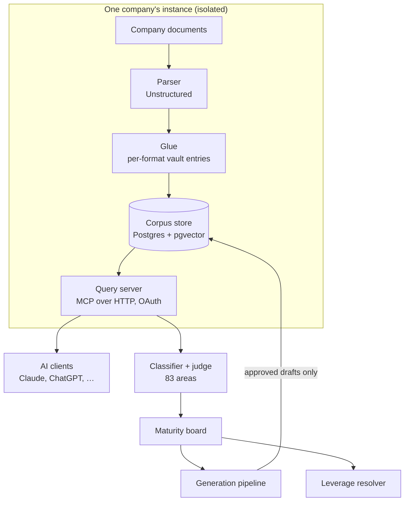

# State of Ladder

What Ladder is, what is built and working, the rules it operates under, and what is still open.
This is the entry point after the [README](README.md); every claim points to the document or code
that backs it.

_Last updated: 2026-10-08._

---

## 1. What Ladder is

Ladder is a single-tenant, self-hostable company knowledge system. Each customer company gets its
own isolated instance (its own repository, database and services), and no shared system holds
several companies' data. It has three layers, built in order
([`Ladder-Product-Concept.md`](Ladder-Product-Concept.md)).

**Memory.** The company's documents, decks, spreadsheets and records are ingested once and become
searchable, cited evidence. Ladder adopts a proven ingestion and serving engine for this and keeps
it behind an interface it controls ([`Sprint-M-Memory.md`](Sprint-M-Memory.md),
[`PORTABILITY-LEDGER.md`](PORTABILITY-LEDGER.md)).

**Maturity.** A reference model describes what a well-run company at this stage maintains. Ladder
scores the company's real evidence against it and produces a maturity board: a color-coded read of
every operating area, with the reasoning and source documents behind each verdict
([`Sprint-Ma-Maturity.md`](Sprint-Ma-Maturity.md), [`reference-model/`](reference-model/README.md)).

**Leverage.** For what the board surfaces, Ladder offers a menu of automation opportunities, each
qualified against the company's own board so the menu offers only what the company is ready for
([`Sprint-L-Leverage.md`](Sprint-L-Leverage.md), [`leverage/MENU-CATALOG.md`](leverage/MENU-CATALOG.md)).

---

## 2. What is built and working

**Memory.** Mixed-format document ingestion (Office files, PDFs, spreadsheets, decks) into a corpus
store with search and a full-recall sweep, served over the Model Context Protocol so any compatible
AI client can query it. The parser is Unstructured; the serving engine is gbrain, behind the
`RetrievalClient` interface in [`scripts/classifier/retrieval.ts`](scripts/classifier/retrieval.ts).
Embeddings are computed when a document is saved. Memory instances run in production for more
than one company.

**Maturity.**
- **Reference model:** 11 categories and 83 operating areas, defined in
  [`reference-model/CRITERIA-SCHEMA.yaml`](reference-model/CRITERIA-SCHEMA.yaml) (v1.5) and
  [`reference-model/TAXONOMY.md`](reference-model/TAXONOMY.md).
- **Board:** the full 83-area board has been run end to end against a real company corpus and its
  results adjudicated by a human reviewer. Each board run carries a **coverage disclosure** stating
  what was and wasn't ingested (for example: documents ingested; code repository, call recordings
  and community channels not ingested), shown on the board itself ([`board/`](board/)).
- **Generation pipeline:** a surfaced gap becomes a reviewable draft, end to end
  ([`reference-model/GENERATION-STANDARD.md`](reference-model/GENERATION-STANDARD.md)). A fixed
  template drives the outline. The corpus is queried per section for evidence. A deterministic
  validator checks structure and **citation truth**: quoted attributions must appear word for word
  in the cited source. A structural self-review and an authority review follow, and a **blind
  quality gate** comes last: a fresh-context reviewer sees only the finished document and the
  persona of the person who would receive it, and blocks anything that isn't ready for them.
- **Document lifecycle:** a draft that clears the pipeline is reviewed and approved as *working* or
  *final*, one document at a time, explicitly, with no batch approval and no automatic adoption
  ([`reference-model/GENERATION-STANDARD.md`](reference-model/GENERATION-STANDARD.md),
  [`scripts/board-server.ts`](scripts/board-server.ts)).

**Leverage.**
- **Menu:** ten automation opportunities across three kinds (enhance what exists, fully automate,
  net-new) ([`leverage/MENU-CATALOG.md`](leverage/MENU-CATALOG.md)).
- **Resolver:** a deterministic resolver qualifies each item against the company's board and a short
  intake, returning *available*, *not yet*, *not offered* or *pilot*, with the exact prerequisites
  to climb ([`leverage/RESOLVER-MAPPING.md`](leverage/RESOLVER-MAPPING.md),
  [`scripts/leverage/resolve-menu.ts`](scripts/leverage/resolve-menu.ts)).
- **Integration with the board:** the menu and board share one origin. The board has a Leverage
  tab, each prerequisite links back to its board tile, and each tile shows which menu items it
  gates.

---

## 3. The rules Ladder operates under

- **The corpus is evidence.** Ingested documents are never rewritten by Ladder. Nothing on an
  instance changes content autonomously.
- **Plans don't flip tiles.** A gap-closure plan is a working artifact. Only the actual target
  document, approved by a person, can move an area to green
  ([`GENERATION-STANDARD.md`](reference-model/GENERATION-STANDARD.md)).
- **Gap class decides the remedy.** Only artifact gaps are closed by generating a document; system
  and practice gaps get recommendations and scaffolds
  ([`GAP-CLASS-DOCTRINE.md`](reference-model/GAP-CLASS-DOCTRINE.md)).
- **Professional review gates.** Documents in areas that need attorney or HR review can't be
  finalized until that review is recorded.
- **Generation exclusions.** Ladder generates nothing in litigation or dispute areas. Those materials
  are kept out of the corpus by policy, and requests are refused before any model call.
- **Provenance blindness and disclosure.** The drafting and review stages never see whether
  evidence is company-native or Ladder-generated. Separately, any evidence Ladder generated is
  labeled on the board.
- **Company-evidence-only view.** Retrieval and the board can be limited to company-native evidence,
  so a pristine baseline view is always available
  ([`retrieval.ts`](scripts/classifier/retrieval.ts), [`board/src/App.tsx`](board/src/App.tsx)).
- **Model routing and spend caps.** Generation, both reviews and the blind gate run on a cost-efficient
  model; the more capable model is reserved for the diagnostic judge. Batch runs carry an explicit
  dollar cap and stop before overrunning it.
- **Stop rule.** A failure at a deterministic gate is a finding to investigate. A draft gets one
  regeneration attempt at most, then the failure is filed and the item stops
  ([`RESEARCH-PROTOCOL.md`](reference-model/RESEARCH-PROTOCOL.md)).

---

## 4. Architecture

- **Parser:** Unstructured (Apache-2.0). Tables are read from their HTML form so column alignment
  survives; an empty parse result is treated as a failure to investigate.
- **Corpus and serving:** gbrain on Postgres with pgvector, hosted per instance. A single service
  embeds at write time and serves queries over MCP with OAuth.
- **Judge and generation:** Anthropic models, behind configuration in
  [`scripts/classifier/`](scripts/classifier/).
- **Swap discipline:** each adopted dependency is logged with its license and swap boundary in
  [`PORTABILITY-LEDGER.md`](PORTABILITY-LEDGER.md).

---

## 5. What is not built yet

- **Live automation loops.** The leverage layer qualifies and recommends automation; implementing
  closed loops inside a company's own tools (CRM, scheduler, call capture) is the next stage. It is
  a hard systems-integration problem and the least-tested part of the design
  ([`Sprint-L-Leverage.md`](Sprint-L-Leverage.md)).
- **Reference-model generality.** The model was calibrated on one mature company. Running the full
  board against an early-stage company in a different sector is the planned test of how well it
  generalizes ([`Ladder-Roadmap.md`](Ladder-Roadmap.md), gate 3).
- **Generation quality on a few document types.** Some templates still produce drafts that the
  citation-truth gate rejects (for example, an HR handbook draft that quoted sources inaccurately).
  The gate is working as intended; the fix belongs on the generation side.
- **More test fixtures.** A golden set of 56 fixture cases checks the judge against known
  expected verdicts. Several further fixtures were set aside at review because they need a
  different test shape (for example, contradictions between two areas), and are recorded for later
  ([`FIXTURES-DEFERRED.md`](docs/working-notes/reference-model/FIXTURES-DEFERRED.md)).
- **Open design rulings.** A handful of criteria and template questions are held for a ruling, for
  example the treatment of 83(b) elections in the capital category. They are tracked in the
  [working notes](docs/working-notes/README.md).

---

## 6. Where everything lives

| Path | Contents |
|---|---|
| [`README.md`](README.md) | Overview |
| [`Ladder-Product-Concept.md`](Ladder-Product-Concept.md) | The thesis, the three layers, a worked go-to-market example, the gap classes |
| [`Ladder-Roadmap.md`](Ladder-Roadmap.md) | Build sequence, principles, decision gates, risks |
| [`Sprint-M-Memory.md`](Sprint-M-Memory.md) · [`Sprint-Ma-Maturity.md`](Sprint-Ma-Maturity.md) · [`Sprint-L-Leverage.md`](Sprint-L-Leverage.md) | Per-layer build specs |
| [`PORTABILITY-LEDGER.md`](PORTABILITY-LEDGER.md) | Adopted dependencies, licenses, swap boundaries |
| [`reference-model/`](reference-model/README.md) | Taxonomy, criteria schema, research protocol, per-category briefs, generation and lifecycle standards |
| [`generation-templates/`](generation-templates/README.md) | Templates that drive document generation |
| [`leverage/`](leverage/) | Automation menu catalog, resolver mapping, menu surface |
| [`board/`](board/) · [`scripts/`](scripts/) | The board UI, classifier, generation pipeline and resolver |
| [`docs/working-notes/`](docs/working-notes/README.md) | The working record: build lessons, method logs, proposals, AI-collaboration rules |

Runs of record, generated drafts and customer corpora are private to each instance and aren't
included in this repository.
